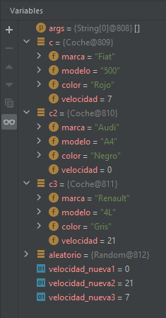
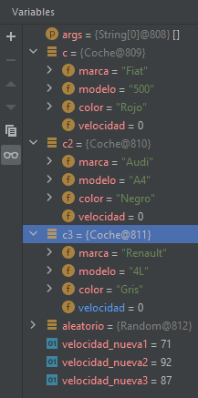

# <font size= 5> <div style="text-align: center"> Entornos de Desarrollo - Unidad 2<br>TASCA 1: DEBUG<div /> <font size= 4> <div style="text-align: right"> *Joan Vidal*        <font /> <div/> 

1. Expliqueu QUÈ FA EL MÈTODE MAIN.

> El métode main crea 3 objectes Coche (instàncies de la classe "Coche").

```javascript
public static void main(String[] args) {
    
Coche c = new Coche("Fiat","500","Rojo");
Coche c2 = new Coche("Audi","A4","Negro");
Coche c3 = new Coche("Renault","4L","Gris");
```

> Asigna un valor aleatori entre 1 i 100 a les 3 variables "velocidad_nuevaX"

```javascript
Random aleatorio = new Random();
int velocidad_nueva1 = aleatorio.nextInt(80);
int velocidad_nueva2 = aleatorio.nextInt(80);
int velocidad_nueva3 = aleatorio.nextInt(80);
```

> Crea una instància de "Random" i 3 variables int, a les que assigna un valor aleatori entre 1 i 80 utilitzant el métode "Random.nextInt()".

```javascript
c2.acelera(velocidad_nueva1);
c3.acelera(velocidad_nueva2);
c.acelera(velocidad_nueva3);
> Suma el valor de les variables "velocidad_nuevaX" a les tres instàncies de "Coche" (c, c2, c3)
```

> Mostra un text y "dibuixa en ASCII" els cotxes amb una quantitat d'espais " " relativa a la seua velocitat.    
>
>       ----- INFO DE LOS 3 COCHES------
>       -----------------------------
>        _/ Fiat  \_
>        o    o 
>       
>           _/ Audi  \_
>           o    o 
>       
>           _/ Renault  \_
>           o    o 

```javascript
System.out.println("----- INFO DE LOS 3 COCHES------");
System.out.println("-----------------------------");

c.pinta();
c2.pinta();
c3.pinta();
```
> Asigna un valor aleatori entre 1 i 100 a les 3 variables "velocidad_nuevaX"

```javascript
		 velocidad_nueva1 = aleatorio.nextInt(100);
		 velocidad_nueva2 = aleatorio.nextInt(100);
		 velocidad_nueva3 = aleatorio.nextInt(100);
```

> Resta el valor de les variables "velocidad_nuevaX" a las tres instancies de "Coche" (c, c2, c3)


```javascript   		 
		 c.frena(velocidad_nueva1);
		 c2.frena(velocidad_nueva2);
		 c3.frena(velocidad_nueva3);  
```
> Torna a "dibuixar" els cotxes segons la seua velocitat actual.

```javascript
		System.out.println("----- INFO DE LOS 3 COCHES------");
		System.out.println("-----------------------------");

		c.pinta();
		c2.pinta();
		c3.pinta();  
```	

2. Posad un punt de ruptura (breakpoint) en la línia 27 del mètode main de la classe Principal i
esbrineu els valors de les variables velocitat_nueva1, velocitat_nueva2 i velocitat_nueva3.
Esbrineu també quines dades tenen en els seus paràmetres els cotxes amb variables c,c2 i c3.

> velocidad_nueva1 == 38  
> velocidad_nueva2 == 42  
> velocidad_nueva3 == 3    
>
> | coche | marca | modelo | color | velocidad |
> |:-:|:-:|:-:|:-:|:-:|
> | c | Fiat | 500 | Rojo | 3 |
> | c2 | Audi | A4 | Negro | 38 |
> | c3 | Renault | 4L | Gris | 42 |
>
>
        
3. Posad un punt de ruptura (breakpoint) en la línia 46 del mètode main de la classe Principal i
esbrineu els valors de les variables velocitat_nueva1, velocitat_nueva2 i velocitat_nueva3.
Esbrineu també quines dades tenen en els seus paràmetres els cotxes amb variables c,c2 i c3.

> velocidad_nueva1 == 71  
> velocidad_nueva2 == 97  
> velocidad_nueva3 == 87    
>
> | coche | marca | modelo | color | velocidad |
> |:-:|:-:|:-:|:-:|:-:|
> | c | Fiat | 500 | Rojo | 0 |
> | c2 | Audi | A4 | Negro | 0 |
> | c3 | Renault | 4L | Gris | 0 |    
>
> 