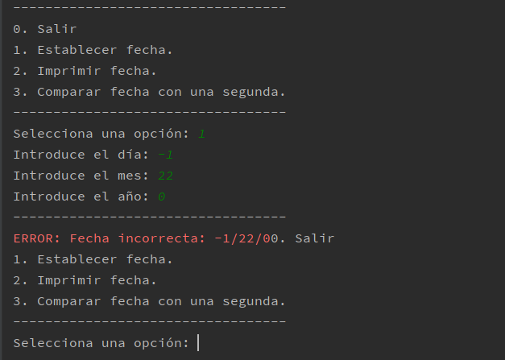

# <font size= 5> <div style="text-align: center"> Entornos de Desarrollo - Unidad 2<br>TASCA 3: FITXERS .JAR (I)<div /> <font size= 4> <div style="text-align: right"> *Joan Vidal*        <font /> <div/>

<h4> Exportem el .JAR del projecte "utiles-data".</h4>

> Accedim al menú de "Project Structure" (drecera de teclat 'Ctrl'+'Shift'+'Alt'+'S')
>
>

> En la pestanya "Artifacts", creem un nou artefacte (Icona '+')
>
>

> Comprobem que el artefacte s'ha creat apareix en la llista i seleccionem "OK".
>
>


> En la barra de tasques seleccionem "Build" i, en el drop-down, seleccionem "Build Artifacts".
>
>
>
> Apareixerà una nova finestra en la que seleccionem quin artefact construïr ("Build").
>
>

<h4> Importem el .JAR al projecte "ED-JAR1-MZFecha".</h4>

> Ja podem copiar el artefacteque s'ha generat ("\\\utiles-data\out\artifacts\utiles-data.jar"*) a la carpeta ("\\\ED-JAR1-MZFecha\lib"), que hem creat manualment.

> Comprobem que el arxiu "utiles-data.jar" apareix a la carpeta lib i que té la classe "MZFecha".
>
>

> De nou al menú de l'estructura de projecte, accedim a la pestanya "Modules" de "Project Settings", després a la pestanya "Dependencies" (del mòdul ED-JAR1-MZFecha) i, finalment a l'icona d'anyadir "+" una nova dependència.
>
>

> Busquem en el explorador de directoris la carpeta lib del nostre projecte i seleccionem el arxiu "utiles-data.jar". Li donem a "OK".
>
>

> Si apareix la nova dependència es que el mòdul està correctament importat, i ja podem treballar amb la classe MZFecha.
>
>

> Ja a la classe principal del nostre programa, declarem un vector d'objectes MZFecha[] i creem els objectes MZFecha en el mètode main.  
> *D'aquesta manera si necessitàrem més de 2 objectes podríem actualitzar el codi més ràpidament. (Tot i que per a aquest propòsit sería molt millor utilitzar un "ArrayList")*
> ```java
>    private static MZFecha[] mzFechas = new MZFecha[2];
>
>    public static void main(String[] args) {
>        for (int i = 0; i < mzFechas.length; i++) {
>            mzFechas[i] = new MZFecha();
>        }
>   }
> ```

> Creem un menú per a la consola i llegim inputs del usuari amb un objecte Scanner (de la llibrería "java.util.Scanner").

> Fem servir el constructor i les funcions de la classe "MZFecha" per a fer el programa.
> ```java
>    static void establecerFecha(){
>        mzFechas[0].setFecha(scannerInt("Introduce el día: "),
>                scannerInt("Introduce el mes: "),
>                scannerInt("Introduce el año: "));
>    }
> ```

> Ens ajudem d'una funció auxiliar per a validar el input del usuari a l'hora d'introduïr les dades.  
> ```java
>static int scannerInt(String s){
>        String inputStr;
>        Integer inputInt = null;
>        System.out.print(s);
>        do{
>            inputStr = sc.nextLine();
>            try{
>                inputInt = Integer.valueOf(inputStr);
>            }
>            catch (NumberFormatException nfe){
>                System.out.print("Input Error." + s);
>            }
>        }while(inputInt == null);
>        return inputInt;
>    }
> ```
>
> NOTA: No vaig utilitzar el "system.error" per al try/catch perque a l'IntelliJ hi ha un problema de desincronització entre els buffers del System.Out i el System.Error.
> 
> ```java
>            catch (NumberFormatException nfe){
>                System.err.print("Input Error.");
>                System.out.print(s);
>            }
> ```
>  
> També podem apreciar l'error si introduïm una data incorrecta, amb el System.err.print que hi ha a la funció setFecha() de la classe MZFecha.  
>  