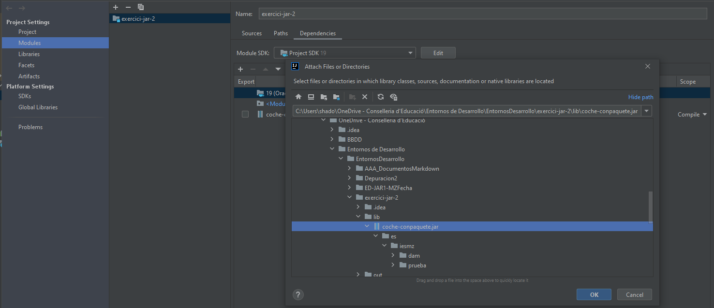

# <font size= 5> <div style="text-align: center"> Entornos de Desarrollo - Unidad 2<br>TASCA 4: FITXERS .JAR (II)<div /> <font size= 4> <div style="text-align: right"> *Joan Vidal*        <font /> <div/>

> Creem el projecte "exercici-jar-2" i la carpeta lib.

> Copiem el mòdul "coche-conpaquete.jar" a "\\\exerexercici-jar-2\lib\"

> Accedim al menú de "Project Structure", Mòdul i anyadim la dependència com ho vam fer en la tasca 3.
>
>

> Per a accedir a la classe Coche en el nostre programa, caldrà importar el "Package".
>```java
>import es.iesmz.prueba.Coche;
>```

> La classe cotxe ja te un constructor per referència i tots els "Getters", "Setters" i funcions necessàries per a fer la pràctica.